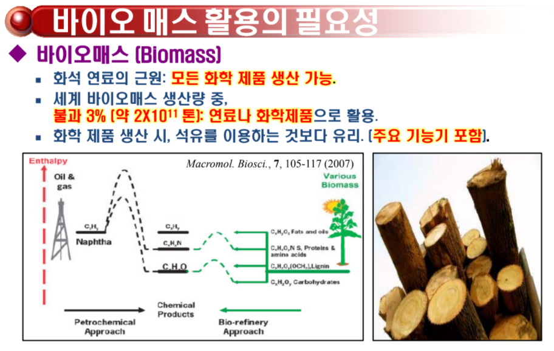
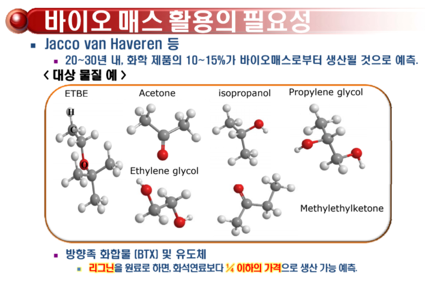

# Biomass

## 1. Biomass란 무엇인가?

## 2. Biomass가 왜 중요한가?

## 3. 장점

이미 산소를 다량 함유하고 있기 때문에 Partial Oxidation이 필요 없다.

## 4. 단점

1. 연료로 쓰기에는 산소가 너무 과량으로 존재
2. 산소를 다 떼버리기에는 비용적으로 많이 든다.
3. 너무 안정하고 HDO 반응을 할 때, 물이 나오는데 이 물이 물의 이온해리상수를 떨어뜨려서 reforming 자체가 힘들다.

## 5. 대체 물질 : 리그닌

세포벽을 강하게 해주는 물질임과 동시에 지구상에서 2번째로 풍부한 유기물이다.

## 6. 공정

1. solvent를 강한 것을 써야한다.
2. 근임계수를 이용해서 리그닌을 쉽게 분해한다. (물의 이온해리상수를 엄청나게 높여서 강한 산염기 촉매로 만드는 것이 포인트)
3. HDO 반응 : 탈산소 반응이 필요하다.
4. 촉매
   1. $Mo$ or $W$ 에 $Ni$ or $Co$을 첨가
   2. $C, TiO_2, ZrO_2$
   3. 미시적으로 구조제어 필요