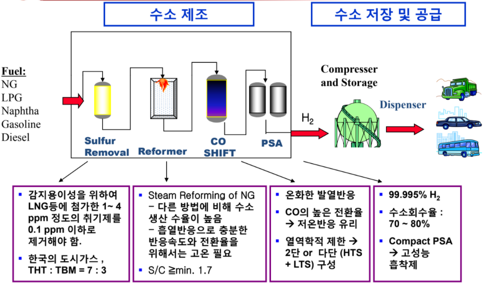
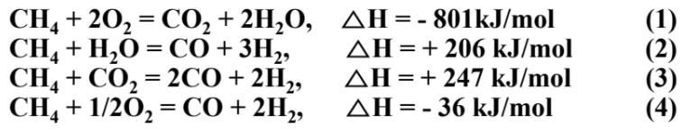

# Energy & Enviromental (수소 제조 기술)

## 1. 수소연료전지와 바이오매스

### 1-1. Hydrogen And Fuel Cell

[전 페이지로 가서 자세히 들여다 보자.](05_cf_hydrogen_fuelcell.md)

### 1-2. Biomass 

[이것도 전 페이지로 가서 자세히 들여다 보자.](04_cf_Biomass.md)

### 1-3. 수소 제조 기술

-------------

## 2. Remove Sulfur

> 불순물인 기존 화석연료에 들어있던 황성분을 제거해야한다. 황은 전기음성도가 쎄서 posioning 기능을 하기 때문이다.

1. 반응
   1. $C_4H_8S + 2H_2 \to C_4H_{10} + H_2S$
      1. 촉매 : $Co-MoO_x/Al_2O_3$ , $Ni-MoO_x/Al_2O_3$
   2. $H_2S + ZnO \to ZnS + H_2O$
      1. 촉매 : $ZnO$

-------------

## 3. Syn Gas Production

### 3-1. Steam Reforming 

> 물을 이용하여 고온에서 cracking을 시도

$$CH_4 or C + H_2O \to CO + H_2$$
1. High Temp에서 산소없이 일어난다.
2. 수소 생산 효율이 좋다. 85% conversion
3. 흡열 반응이다.
4. WGSR이 $CO + H_2O \to CO_2 + H_2$ 발열반응이지만 side reaction으로 일어난다.
5. PEMFC에 있는 Pd를 $CO$ 가 poisoning 할 수 있다.
6. 촉매 : $Ni / Al_2O3$

### 3-2. Partial Oxidation

> 산소를 이용하여 완전산화 대신 불완전산화를 주 목적으로 한다.

1. ex) $CH_4 + O_2 \to CH_3OH$. 
2. 단점
   1. 산화는 발열반응이고 $\delta G < 0$ + 모든 반응들이 다 일어날 수 있기 때문에, 이를 불완전연소만 되도록 control하기 힘들다.
   2. 발열 반응이기에 sintering이 일어날 수 있다.
      1. $Ni$ 같은 입자는 coking 현상이 생긴다.
      2. 이를 방지할 고분산 support 가 필요하다.
      3. 또한 고온에서 버틸 수 있는 반응기도 필요.
   3. O_2 가격에 예민
   4. 고온이라서 $NO_x$ 생성 우려
3. 촉매 : $Pt/Al_2O_3, Pt-Pd/Al_2O_3, Ni/Al_2O_3$

### 3-3. Autothermal

> 물과 산소 둘다 이용해서 합성가스를 만들어내는 방법

1. $H_2O, O_2$ 둘 다 쓴다.
2. 외부로부터 열 공급 X
3. 촉매
   1. $Pt/CrO_x$
   2. $Pt-Pd,Pt-Rh $(Partial Oxidation & Steam Reforming)
   3. noble metal/monolith (Partial Oxidation) + $Ni/Al_2O_3$

-------------

## 4. $H_2$ Purification

### 4-1. WGSR (Water Gas Shift Reaction) 

> 일산화탄소을 이용해 물을 넣어서 수소를 생성

$$CO + H_2O \to CO_2 + H_2$$

1. 이 반응이 발열반응이기에 반응이 진행될수록 온도가 올라가고 평형은 왼쪽으로 쏠리게 된다.
2. 해결 : High Temp 에서 반응시켜 먼저 반응을 빨리 진행시킨다. ($FeO_3, FeCr$ : LT에서 Cu가 sulfide에 약하다.)
3. 해결 : Low Temp 으로 낮춰서 평형을 오른쪽으로 쏠리게 만든다. ($Cu$)
4. 해결 : Low Temp에서 반응속도가 느려 큰 반응기가 필요
5. 촉매
   1. $Fe_2O_3, FeCr$
   2. $Cu$

### 4-2. PROX (PReferiential OXidation)

> 원하는 물질만 선택적으로 산화하는 반응을 말한다.

1. $CO$ 를 먼저 산화시키는 것이 포인트
2. 열역학적으로는 $H_2$가 $CO$ 보다 잘 산화된다.
3. 촉매
   1. $Ru/Al_2O3, Pt-Ru/Al_2O3, Pt/Al_2O3,$

### 4-3. Metal Membrane

> Membrane을 통해 선택적으로 원하는 분자만 추출

$Pd-Cu$ membrane은 $H_2$만 선택적으로 흡수해서 통과, but 비귀금속 계열로 대체제 개발 필요.

-------------

## 5. PSA (Pressure Swing Adsoprtion)

> pore를 가지고 있는 molecular sieve를 이용하여 어떤 특정 조건에서 흡착물질이 흡착제에 달라붙는 친밀도 차이를 이용해서 분리하는 공정

여러개의 탑, step으로 나누어서 물리적인 흡착을 진행한다.

주로 쓰이는 것이 활성탄이다.