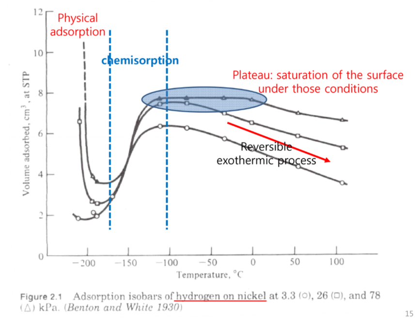
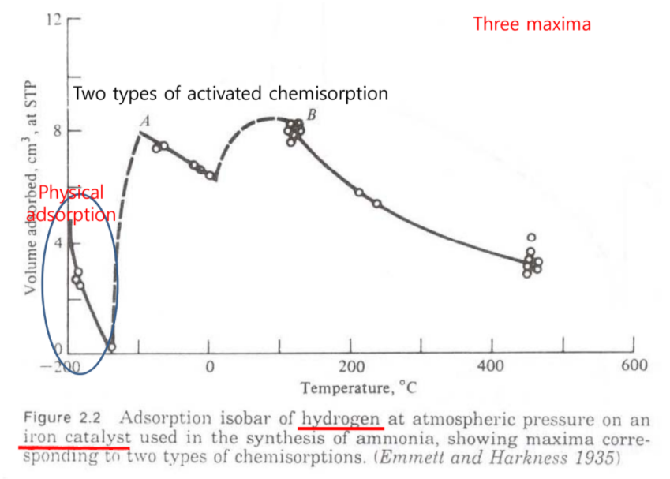
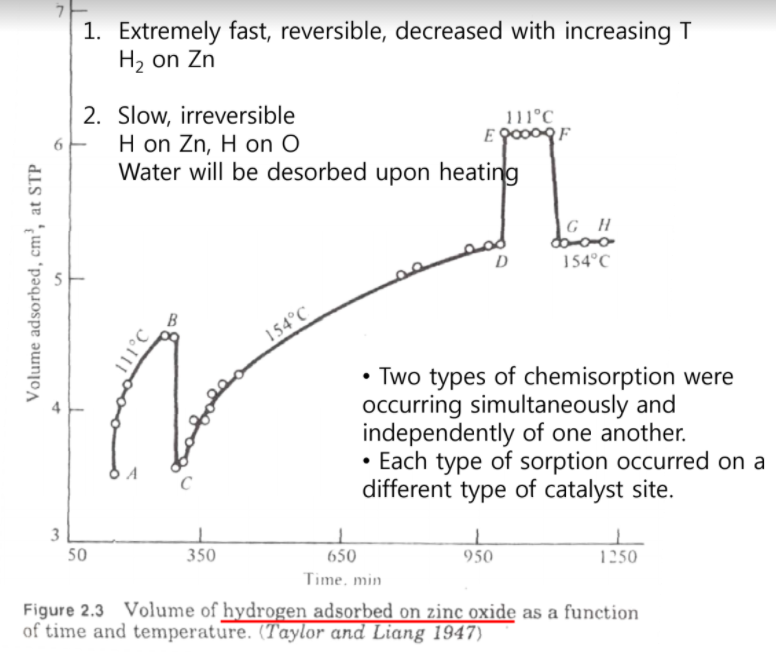
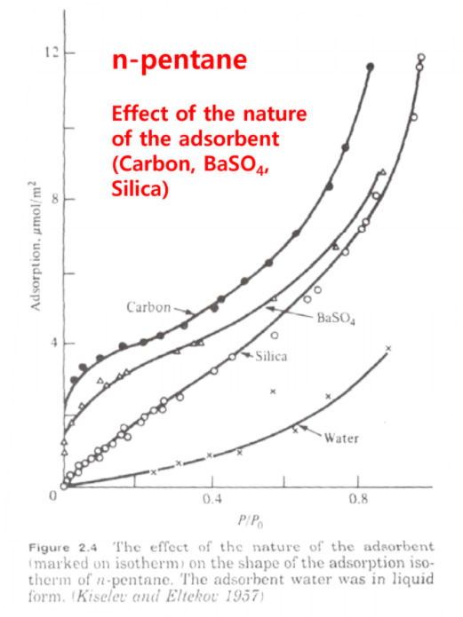
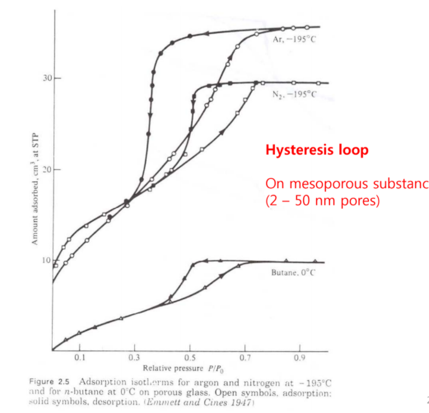

# Adsorption

## 1. Physisorption vs Chemisorption

### cf) Adsorption이 자발적인 이유

_**흡착이 자발적인 이유는 dipole-dipole or induced dipole interaction 같은 2차인력에 의해 생기기 때문이다.**_

_**따라서 흡착할 때 발열반응이라는 것이다.**_ $\triangle G < 0, \triangle S<0$, 따라서 $\triangle G = \triangle H - T \triangle S$ 에 의해, $\triangle H$ 는 무조건 0보다 작아야한다.

### 1-1. Physisorption

> van der waals interaction에 의해서 물리적인 흡착을 하는 것을 말한다.

#### 특징)

- monolayer ~ multilayer 가능하다.
- condensation이 일어나기도 한다.
- 모든 surface에서 존재한다.
- 무조건 발열반응이다.

### 1-2. Chemisorption

> 촉매 층의 구성성분이 변함없이 surface atom과 반응물과 전자를 주고받으며 생성물을 만들어내는 과정을 말한다.

#### 특징

- monolayer만 가능하다.
- 특정 site에서만 일어난다.

#### 중요한 이유 (이게 젤 중요하다.)

1. 촉매 반응에서 직접적으로 관련된 부분
   1. 표면의 원자들이 반응물과 전자를 직접 주고 받으며 반응이 이루어지기 때문이다.
2. 반응의 mechanism을 파악 가능하다.
   1. 중간에 bonding을 해서 중간체를 만들어낸다.
   2. 중간체를 거치면서 새로운 생성물을 만들어낸다.
3. 촉매를 해석할 수 있다.

-------------

## 2. Characterization of Adsorption

> 흡착을 어떻게 특징화할까?

### 2-1. Directly 관찰

1. Conductivity (전자이동 : band 형성하면 보임)
2. Work Function (전자이동 : band 형성하면 보임)
3. Paramagenetism (흡착물이 paramagnetism이기 때문에)
4. 직접 관찰 :
   1. 촉매를 관찰 : SEM, TEM, STEM, HRTEM
   2. 흡착물을 관찰 : IR, NMR

### 2-2. Heat Effect

> monolayer를 형성하기 위한 몰당 흡착열

$$\frac{\delta \ln P}{\delta T} = \frac{q=\triangle H}{RT^2}$$

흡착열로 서로 구분이 거의 가능하다.

#### Physisorption

- 보통 10KJ/mol. 생각보다 크지 않다.
- ex) Zeolite
  - 분자 size가 크면, 저항도 심해져 발열이 많이 일어난다.
  - 주변 pore 때문에 흡착열에 영향이 갈지도 모른다.
  - 무조건 흡착열이 크다고 해서 무조건 chemisorption 이라는 보장은 없다.
- 무조건 발열반응이다.

#### Chemisorption

- 80~200KJ/mol, 600까지도 가능하다.
- coverage, $\theta$ 에 비례한다.
- 발열반응이 대부분이지만 간혹 흡열반응도 존재한다.

-------------

## 3. Rate of Adsorption

> 흡착할 때의 반응속도식은?

$$\ln k = -\frac{E_a}{RT}$$ 
$$\ln K = \ln \frac{k_a}{k_d}=-\frac{E_a}{R}(\frac{1}{T_a}-\frac{1}{T_d})$$

### 3-1. Physisorption

1. condensation
2. no activation E

### 3-2. Chemisorption

1. Activation E는 필수
2. $E_a$ 는 아레니우스 식에 의해서 T에 의존적이다.

-------------

## 4. Effect of Temperature & Pressure on amount adsorbed

> 온도와 압력을 조절하였을 때 흡착되는 양이 어떻게 변화하는지?

### 4-1. Physisorption

- Temperature가 높을수록 흡착량은 낮아진다.
- Pressure에 경우 $\frac{P}{P_0}$ = 0.1이면 monolayer
- Pressure에 경우 $\frac{P}{P_0}$ = 0.1 ~ 0.3이면 multi-layer, condensation 일어남.
- Pressure에 경우 $\frac{P}{P_0}$ = 1 이면 Bulk

### 4-2. Chemisorption

- Temperature가 낮을수록 흡착량은 
- 온도를 조절하는 것 보다는 여러 site가 존재하기 때문에 각각 다르다.

-------------

## 5. Reversibility

> 촉매에서의 반응이 가역인지 비가역인지?

### 5-1. Physisorption

- reversible
- Diffusion이 빠르면 평형에 금방 도달한다.
- Example) PSA, TSA, PTSA

### 5-2. Chemisorption

- irreversible : 이미 반응은 이루어졌기 때문에
- 다른 molecule이 나왔다면 이미 반응은 이루어진 것이다.
- Example) $H_2/D_2$ 측정 방법

-------------

## 6. Specificity

> 특정 구역에서만 일어나는가? 아니면 전체적으로 다 일어나는가?

### 6-1. Physisorption

- non-specific : 어디든

### 6-2. Chemisorption

- specific : 각 촉매마다 각 site 마다 specific 한 반응이 이루어진다.
- 표면의 특성 및 전처리에 따라 다르다. ex) $Al_2O_3 , TiO_2$
- isobar와 isotherm 방법을 많이 사용한다.

#### Isobar

1. 처음에 Physisorption이 활발하게 이루어진다.
2. coverage가 줄어들수록 흡착하는 양도 줄어든다.
3. 일정 임계점을 넘어가면서 coverage가 커질수록 chemisorption은 활발해진다.
4. 일정 압력 이상에서는 plate한 구조를 가진다. 이는 saturated surface를 의미하는 것이다.
5. chemisorption이 끝난 이후에는 다시 physisorption 진행. reversible 한 발열반응이 진행된다.

1. 처음에는 낮은 coverage에 의해 physisorption이 이루어진다.
2. 첫번째 chemisorption이 이루어진다.
3. 다시 physisorption 이루어진다.
4. 두번째 chemisorption이 이루어진다.
5. 다시 physisorption이 이루어진다.

이말은 똑같은 iron이지만 active site가 두 개 존재한다는 의미이다. 온도차이에 따라 chemisorption을 달리했으니 말이다. 또한 active site 끼리 흡착물을 흡착하는 세기도 다른 것을 볼 수 있다.

1. 처음에는 $H_2$ 가 $Zn$ 에만 붙어서 chemisorption을 한다.
2. 그리고 온도를 올렸더니 다른 기울기를 보여주는 chemisorption이 일어났다. 이는 $H_2$ 가 $Zn, O$ 둘 다 붙는다.
3. 그리고 온도를 아까랑 똑같이 하였더니 전혀 다른 active site를 보여주었다.

이 그래프는 2가지의 chemisorption이 독립적이지만 동시에 발생한다는 것을 보여준다. 

#### Isotherms

처음에는 coverage가 0이기 때문에 넣는 족족 physisorption 되지만, 일정 multilayer 가 쌓여 condensation이 일어나면 기하급수적으로 숫자가 증가한다.

- Hystersis Loop : 흡착 곡선과 탈착 곡선이 다른 것을 의미한다.
- ex) zeolite 처럼 pore 구조를 가진 촉매 : 들어갈 때는 상관없지만, 나갈때는 pore 의 입구가 작기 때문에 빠져 나가기가 힘들어 탈착 속도가 훨씬 더디다.

-------------

## 7. Model for Adsorption Isotherms

### 7-1. Langmuir Isotherm

> 1. 1개의 site에는 1개의 흡착물질 1개의 흡착종만 가능하다.
> 2. 열용량 변화량과 coverage는 관계가 없다.

### 7-2. Equation

$$\frac{dn_A}{dt} = k_a (1-\theta)P_A$$
$$\frac{dn_A}{dt} = k_d \theta$$
$$K = \frac{k_a}{k_d}$$
$$\theta = \frac{KP_A}{1+KP_A}$$