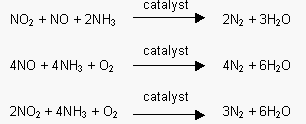
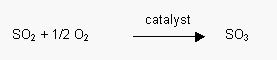
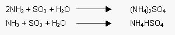

# Forming Operation

- physical property : 생성물의 강도, pore volume & pore size distribution, activity, cost를 고려해야한다.
- 높은 melting point를 가지는 촉매는 강도가 세기 때문에 첨가제 없이는 못 만든다.
- 마모 강도를 증가시키는 공정은 하면 안된다. pore가 다칠수도 있엉
- 전형적인 상업 촉매는 void fraction이 $0.5cm^3/cm^3 pellet$

## 0. Skin Effect

> Pelletizing, Extrusion에 경우 강한 압출을 하기 때문에 pore가 작아지는 문제가 생긴다. 이는 diffusion limitation 을 초래할 수도 있다.

_**이러한 문제는 Drying or Calcination 작업에서 최대한 안에 있는 Gas를 충분히 빼줘야한다.**_

-----------

## 1. Pelletizing

>  precipitation해서 만든 powder를 압축해서 pellet or ring 형태로 만든다.
-  Die Lubricant (die에 붙지 말도록) & Binder (powder 끼리 잘 붙도록)
-  Extursion에 비해서 비싼 공정 (압축하는 비용이 크다.)
-  binder에 경우 clay를 많이 쓰는데 powder에 직접 넣기 때문에 clay 안에 이온이 들어가서 바꿔둘 수 있다. sodium 같은 경우가 들어가게 되면 poisoning 을 하게 된다.

-----------

## 2. Extrusion

> die에서 길게 압축해서 빼냄

-----------

## 3. Shell Catalyst

> 촉매가 너무 활성이 큰 경우, support 위를 덮어서 활성물질이 표면에 존재하지 않으면 diffusion 저항이 생기는 경우 적용한다.

### Example

1. $V_2O_5/TiO_2$ : $TiO_2$ support 위에 $V_2O_5$ 을 덮어서 사용. Parital Oxidation에 주로 사용
2. $V_2O_5/TiO_2$ 을 monolith (벌집모양 support) 위에 올려서 Selective Cataltyic Reduction을 적용해서 $NO_x \to N_2 + H_2O$ 로 사용한다.

-----------

## 4. Sphere

1. Fine Sphere : Spray-drying 방법을 사용
2. Larger : rotating graulator를 사용
3. smaller : 섞이지 않는 liquid에 drop하여 만든다.

-----------

## 5. Graules

1. grinding 하여 알갱이로 만들어 사용

-----------

## SCR (Selective Catalytic Reduction)

SCR 반응에서 selective 하게 이루고 싶은 반응이다.

reduction을 하는 촉매이기 때문에 sulfide 계열도 반응에 참여한다. 하지만 이친구들은 poisoning을 하는 대표적은 물질이다.

또한 배출가스 중의 황 함량이 높고 Ammonia Slip양이 많을 경우 상호 반응에 의해 Ammonium Sulfate ((NH4)2SO4) 혹은 Ammonium Bisulfate (NH4HSO4)가 발생하며, 이는 촉매의 표면에 달라 붙어 촉매와 Gas와 접촉을 방해하여 촉매의 성능을 저하시키고, 후단에 설치된 열교환기 등의 표면에 달라 붙어 설비의 막힘 및 부식의 주요 요인이 된다. (암모니아 요소수도 양 조절을 잘 해야한다.)