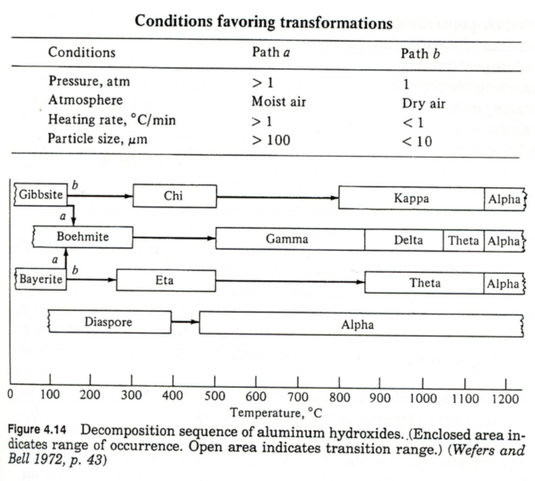

# Catalyst Support

----------

## 1. Background

### 1-1. 초기 support

> 단지 metal catalyst를 올려두는 기능

### 1-2. 지금 support

1. Catalyst 활성에 영향을 준다.
2. 촉매 주위 환경을 조절하기도 한다.
3. 고분산을 도와준다.

### 1-3. Support 선정 기준

> 촉매의 선정 기준과 거의 동일하다고 보면 된다.
> 
1. 원하지 않는 반응에 대해서는 반응 X
2. 비용
3. 고온에서도 안정성 유지 가능성
4. 기계적인 property
5. surface area
6. porous 한 구조

### 1-4. 주요 담체

1. $Al_2O_3$
2. $SiO_2$
3. 활성탄
4. $ZnO$
5. $MgO$
6. $ZrO_2$

### 1-5. Sintering 에 대한 저항

1. Tammann Temp : bulk가 움직이는 온도 (0.5T)
2. Huttig : surface가 움직이는 온도 (0.3T)
3. 1B 금속 : Cu, Ag, Au : huttig temp이 100도.
   1. 무조건 담지가 필요하다.
   2. 아니면 sintering을 물리적으로 막아주는 textural promotor가 필요
4. Fe, Co, Ni은 300도부터 huttig temp
5. Pt는 1300K 로 높지만 가격때문에 무조건 고분산해서 써야한다.

----------

## 2. Alumina

### 2-1. Alumina 장점

1. 싸다
2. 안정성이 뛰어나다
3. Pore 조절이 자유롭다.
4. 고분산 가능하다.

### 2-2. Alumina 딘점

1. 유사 spinel 구조를 가져서 2가 금속이온이 오게되면 변형이 일어난다.
2. Temperature에 따라서 property가 변한다.
3. 싸기 때문에 Na, Fe가 소량 포함될 가능성이 존재한다. 이는 sintering을 유발할 수 있다.

### 2-3. 제조 공정

#### 1) Bauxite

> 점토에서 풍화된 물질들. 여러 물질들이 다량 포함되어있다. ($AlO(OH), Al(OH)_3, SiO_2, Fe_2O_3$)

#### 2) Bayer 공정

> Al 관련 물질만 뽑아내는 작업이다.

1. Bauxite를 $NaOH$ 를 넣어서 용해하면 $NaAlO_2$ 생성
2. $Si, Fe$는 mud 형태로 filtering 된다.
3. $NaAlO_2$ 를 물로 희석하면 $\alpha-Al_2O_3.3H_2O$ gibbsite 가 생성된다.
4. sodium이 surface로 이동하면서 sintering을 촉진한다.

#### 3) Transformation sequences

#### 4) 고온 촉매

1. $\gamma-Al_2O_3$ : 250-350$m^2/g$ 고표면적을 가진다.
2. $\gamma-Al_2O_3 \to \delta-Al_2O_3 \to \theta-Al_2O_3 \to \alpha-Al_2O_3$
3. $\alpha-Al_2O_3$ 는 반응성이 거의 없다.

#### 5) 표면 acidity

1. heating에 의해 OH기가 물로 빠져나가면 그 자리를 lewis acid
2. OH기가 남아있게 된다면 Bransted base

#### 6) $\gamma-Al_2O_3$ 안정성 증가방법

1. Silica를 추가해준다. 산성도 증가한다.
2. 2가 이온을 먼저 넣어준다. $Ba, Mg, Ca$를 첨가하면 유사 spinel구조가 먼저 바뀐다. 띠라서 spinel의 tetrahedral 구조로 2가 이온들이 들어가면서 구조가 안정성을 가진다.

----------

## 3. Silica

### 3-1. 제조법

1. $Na_4SiO_4$ & $Na_2SiO_3$ 을 포함하는 water glass 용액과 산을 혼합
2. pH가 낮아지면 polymerization이 일어남.
3. 따라서 $Si(OH)_4$ 을 생성하고 $SiOH$ 가 condensation 되어 $Si-O-Si$ 을 생성 $\to$ HydroGel 생성 (구형에 가까운 micelle로 구성된 gel)

### 3-2. 특징

1. 큰 pore size를 가진다.
2. 안정성이 뛰어나다.

### 3-3. Alumina와 비교

1. 촉매의 property : Alumina가 뛰어남
2. 촉매의 안정성 : Silica 가 뛰어남 (sintering 에 안정)
3. 산의 안정성 : Silica가 뛰어남

-----------

## 4. Activated Carbon

### 4-1. 제법

> Coal, Wood, 석유 등으로 산소없이 가열한다.

### 4-2. 특성

> 굉장히 많은 pore를 가지지만 많이 쓰기 힘들다. 막힐 확률이 높기 때문

### 4-3. 적용

> Steam or CO2로 Oxidation Control : 기공이 생기고 표면적이 증가한다. 활성화 가능.

-----------

## 5. $TiO_2$

### 5-1. 구조 & 특성

1. Anatase
   1. 낮은 온도에서 제조
   2. 표면적이 넓다.
2. Rutile
   1. 높은 온도에서 제조
   2. 안정성이 좋다.
3. Brookite
4. Band Gap이 커서 광촉매로도 사용 가능

### 5-2. 응용

1. $V_2O_5/TiO_2$ : O-xylene 에서 phathalic anhydride 로 변환
2. $V_2O_5/TiO_2$ + monolith : SCR 반응에서 효과적