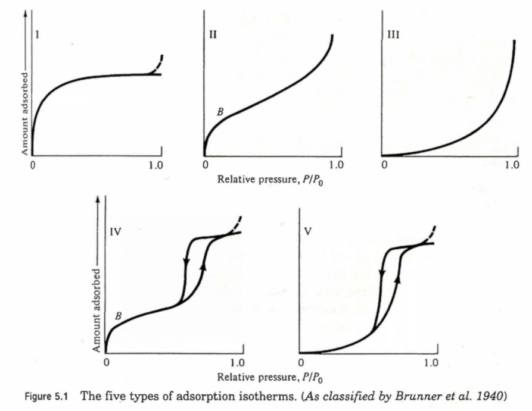
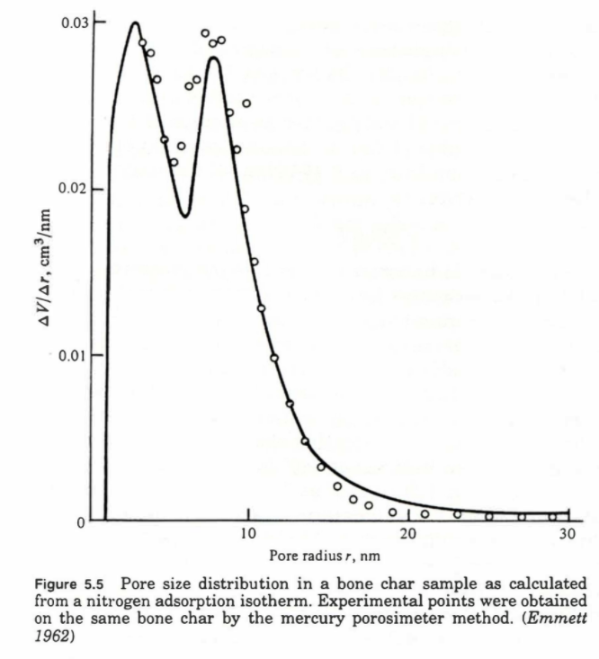

# Characterization : Surface Area

## 1. Physical Adsorption Isotherm

### 1-1. 가정

- non-specific physical adsorption 이 진행된다.
- Partial Pressure가 증가하면 흡착양은 증가한다.

1. 일반적인 형태, monolayer를 유지하다가 condensation이 되고나서는 기하급수적으로 증가한다.
2. monolayer를 빨리 쌓고 multi-layer을 거치면서 Condensation이 일어나는 형태
3. 흡착물이 surface와 친하지 않은 경우, condensation만 일어난다.
4. pore가 있는 구조. Hystersis Loop가 존재한다. : pore 안에 갇혀서 들어올 때는 빨리 들어오지만 나갈 때는 입구가 좁아서 천천히 나간다.
5. pore가 있는 구조이지만 흡착물이 surface와 친하지 않은 구조

### 1-2. BET (Brunauer-Emmett Teller)

$$\frac{P}{V(P_0-P)} = \frac{P}{P0}\frac{C-1}{V_mC} + \frac{1}{V_mC}$$

$$S = (\frac{V_m N_0}{V})\alpha$$

- $V$ : P 일때의 흡착된 양의 부피
- $V_m$ : P 일때의 monolayer로 흡착된 양의 부피
- $C$ : 기체의 액화열과 흡착열을 뺀 값
- $\frac{P}{V(P_0-P)}, \frac{P}{P0}$ 관련된 식으로 나타내서 plot을 그리면, 기울기와 y절편 값을 더한 값이 $\frac{1}{V_m}$ 이다.
- 따라서 $V_m, C$ 를 구할 수 있다.
- 만약 _**흡착분자 하나의 average area를 알면 $V_m$을 곱해서 구할 수 있다.**_ 따라서 2번째 식처럼 $\alpha$ 와 $V(22.4L)$, $N_0$ 을 구해서 미리 구해놓았던 $V_m$에 곱하면 solid mass 당 surface area가 나온다.
- 주로 질소 기체를 쓴다.
- 측정하기 전에는 Vacuum으로 surface 위에 모든 입자들을 날려야한다.

### 1-3. Selective Chemisorption

> 금속 촉매에 특정적으로 흡착하는 분자들을 이용한다.

1. 수소기체를 제일 많이 사용한다. $Pt, Ni$ 이 최적이다.
2. but. Pd는 수소 기체를 excess 양으로 흡착하기에, $CO$ 로 흡착한다. Fe 도 $CO$ 로 흡착한다.
3. Ag : $O_2$
4. Carbon Support or Carbon Contamination는 흡착된 수소가 금속을 타고 support 표면까지 달라붙는 spillover 현상이 일어난다.
5. Silica, Alumina는 일어나지 않는다.

-----------

## 2. Dispersion 측정

### 2-1. 고분산이 중요한 이유

1. 같은 양의 촉매로 표면적을 넓힐 수 있다. 반응에 필요한 active site 갯수가 늘어난다.
2. Coordinately Unsaturated Site 를 많이 만들 수 있다.
3. support와 상호작용으로 activity, selectivity 변화

### 2-2. 고분산 측정방법

> (surface 원자 수) / (Bulk 원자 수)

1. TPD로 분석 가능
   1. $H_2$
   2. $N_2$ or Pyridine or $NH_3$
2. X-Ray pattern으로 분석 가능
   1. line이 broad 하게 나타나면 그만큼 peak이 촘촘하게 겹쳐있다는 것을 의미한다. 즉, size가 작다는 의미이다.
   2. size가 크면 line 이 sharp 하게 나온다.
3. EM으로 분석 가능

-----------

## 3. Pore Volume 측정

1. Distilled water을 넣어서 dry 시킨다. pore volume 만큼 물이 들어갔을테니 이를 중량을 체크
2. 머큐리 방법

-----------

## 4. Pore Size Distribution

### 4-1. Kelvin Equation

$$r - \delta = \frac{-2\sigma V_l \cos\theta}{R T \ln (P/P_0)}$$

- $r$ : pore radius
- $\delta$ : 흡착된 film의 두께
- $\sigma$ : surface tension
- $V_l$ : $N_2$의 molar volume
- $\theta$ : contact angle
- y축이 $\frac{\triangle V}{\triangle r}$, x축이 $r$ 이다

-----------

## 5. Catalyst Characterization

1. 성분분석 (Bulk vs Local)
   1. ICP (inductively Coupled Plasma) : Metal
   2. EA (Elemental Analyzer) : C,H,N,S
   3. EDX (Energy Dispersive X-ray Spectroscopy) : local information
2. 결정구조분석
   1. XRD (X-Ray Diffraction) : single crystal
   2. ED (Electron Diffraction) : Local Information
   3. LEED (Low Energy Electron Diffraction)
3. 나노구조확인
   1. SEM
   2. TEM
   3. STEM
4. 표면특성분석
   1. XPS (X-ray Photoelectron Spectroscopy)
   2. AES (Auger Electron Spectroscopy)
   3. LEED (Low Energy Electron Diffraction)
5. 촉매 자리 세기 양 측정
   1. TPD
   2. pyridine or 암모니아 or BF3 을 이용한 in-situ IR (lewis or bransted)
   3. Selective Cheisorption : $H_2, CO$