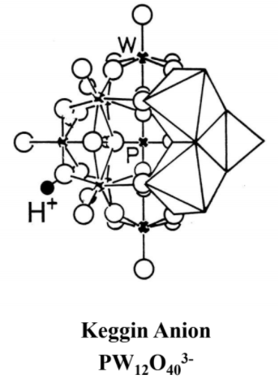

# Introduction

## 헤테로폴리산이란?

1. 고체 산촉매이면서 redox reaction을 하는 bifunctionality 촉매
2. 텅스텐 자리를 다른 금속과 바꿔가면서 여러가지 헤테로 폴리산 생성 가능
3. 크기가 상대적으로 커서 soft한 이온이다. 따라서 수소를 잘 떼어낼 수 있기 때문에 굉장히 강한 산이다.
4. 촉매로써 기능을 할 때, 흡착물질을 bulk 안으로 끌어들여 반응하기 때문에 (solid, pseudo liquid, liquid)selective가 일정하다.
5. Cs을 넣어 산 세기 조절